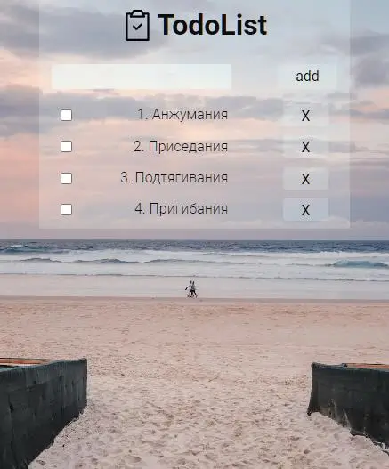

# react-ts-project-todo

Проект знакомство |первое касание| c TypeScript в React. Проект будет исполнятся по видео https://youtu.be/v8i-cv9NUV0?si=yWmrwajI5kQM2K8q\
Демо приложения [GH-pages](https://forgohill.github.io/react-ts-project-todolist/)

  <h1>Приложение <b>TodoList</b></h1>

  

## 🧱 Функционал приложения :
- Создание списка дел

## 🛠️ Стек и Инструменты :

## 📊 Статус и планы по доработке проекта :

### Статус:
🔴 Проект закрыт.

### Планы по доработке проекта :
⚠️ Сдлеать так чтобы блок с задачами прокруичвался вниз при добавлении задач\

---
# Как запустить запустить приложение Create React.

Этот проект был создан с помощью [Create React App](https://github.com/facebook/create-react-app).

### Доступные скрипты :

В каталоге проекта вы можете запустить:

#### `npm start`

Запускает приложение в режиме разработки.\
Открыть [http://localhost:3000](http://localhost:3000) чтобы просмотреть его в вашем браузере.

Страница перезагрузится, когда вы внесете изменения.\
Вы также можете увидеть любые ошибки lint в консоли.

#### `npm test`

Запускает программу тестирования в режиме интерактивного просмотра.\
Смотрите раздел о [«работа с тестами»](https://facebook.github.io/create-react-app/docs/running-tests) для получения дополнительной информации.

#### `npm run build`

Создает приложение для рабочей среды в папке `build`.\
Оно корректно объединяет React в рабочем режиме и оптимизирует сборку для достижения наилучшей производительности.

Сборка сокращена, а имена файлов содержат хэши.\
Ваше приложение готово к развертыванию!

Смотрите раздел о [разработке](https://facebook.github.io/create-react-app/docs/deployment) для получения большей информации.

### `npm run eject`

**Примечание: это односторонняя операция. Как только вы запустите `eject`, вы не сможете вернуться назад!**

Если вас не устраивает инструмент сборки и выбранная конфигурация, вы можете запустить `eject` в любое время. Эта команда удалит единственную зависимость сборки из вашего проекта.

Вместо этого он скопирует все файлы конфигурации и переходные зависимости (webpack, Babel, ESLint и т.д.) прямо в ваш проект, чтобы вы имели полный контроль над ними. Все команды, кроме `eject`, по-прежнему будут работать, но они будут указывать на скопированные скрипты, чтобы вы могли их настроить. На этом этапе вы предоставлены сами себе.

Вам никогда не придется использовать `eject`. Разработанный набор функций подходит для небольших и средних развертываний, и вы не должны чувствовать себя обязанным использовать эту функцию. Однако мы понимаем, что этот инструмент был бы бесполезен, если бы вы не могли настроить его, когда будете к этому готовы.

